<p align="center">
  
  
  
  
  
</p>

<h1 align="center">Mamba-3</h1>

<p align="center">
  The whole of <a href="https://arxiv.org/abs/2603.15569">Mamba-3</a> in one file —
  official <a href="https://github.com/state-spaces/mamba"><code>mamba_ssm</code></a> API,
  pure PyTorch, no kernels to build, no backend to pick.
</p>

<p align="center">
  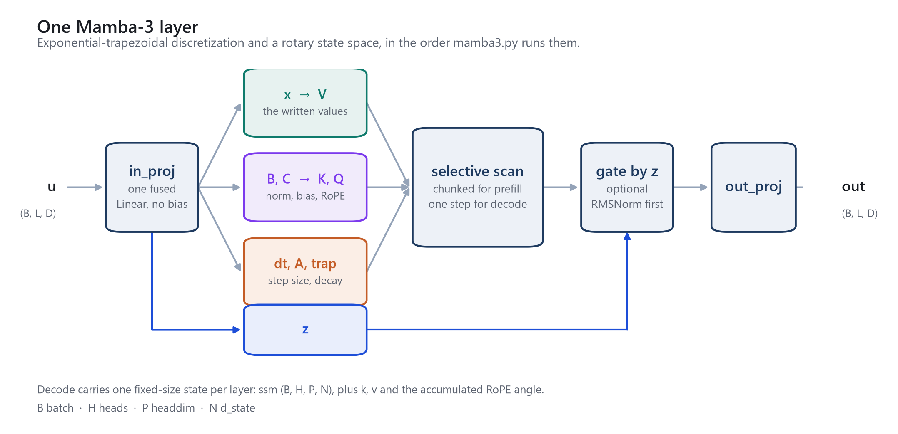
</p>

Copy [`mamba3.py`](mamba3.py) into your project, `pip install torch`, and you have Mamba-3 on whatever device PyTorch is already using: SISO and MIMO, chunked prefill, single-step decode, graph replay that composes with `torch.compile`, gradients included.

**Nothing to build.** No nvcc, no CUDA Toolkit, no MSVC, no Triton, no TileLang, no einops, no `mamba-ssm`. A PyTorch install is the entire dependency list — which is what makes this work on Windows, inside a locked-down container, or on a cluster where you cannot install a toolchain.

**Any device PyTorch has.** The math is ordinary PyTorch ops and the runtime calls around graph capture go through `torch.accelerator`, so there is no vendor-specific path to fall off. The file follows PyTorch to whatever device it supports, CPU included — and CPU is not a degraded mode: given the same weights, forward, backward and decode land within ~3×10⁻⁶ of CUDA in fp32.

**Not a lookalike.** What this file replaces is the official *kernel backend*, not the interface — which is why [the official usage snippet](#install) runs on it with only its import line changed.

<p align="center">
  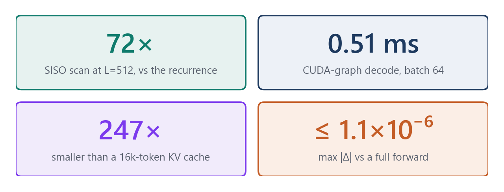
</p>

---

## Install

```bash
pip install torch
```

A layer is a drop-in for self-attention — same shape in, same shape out, and a width is the only argument it needs:

```python
import torch
from mamba3 import Mamba3

layer = Mamba3(d_model=768)              # SISO, upstream defaults
y = layer(torch.randn(2, 2048, 768))     # (B, L, D) → (B, L, D)
```

And the official README's own example runs here as written — the import line is the only edit:

```python
import torch
from mamba3 import Mamba3          # was: from mamba_ssm import Mamba3

batch, length, dim = 2, 2048, 768
x = torch.randn(batch, length, dim).to(torch.bfloat16).to("cuda")
model = Mamba3(
    # This module uses roughly 6 * d_model^2 parameters
    d_model=dim,            # Model dimension d_model
    d_state=128,            # SSM state size
    headdim=64,             # SSM headdim
    is_mimo=True,           # Use MIMO mode
    mimo_rank=4,            # MIMO rank when is_mimo=True
    chunk_size=16,          # 64/mimo_rank if x is in bf16, else 32/mimo_rank
    is_outproj_norm=False,  # Additional post SSM norm
    dtype=torch.bfloat16,
).to("cuda")
y = model(x)
assert y.shape == x.shape
```

Arguments neither example shows (`rope_fraction`, `ngroups`, `expand`, `dt_min` …) are upstream's as well, with upstream's defaults.

`"cuda"` is just what upstream wrote. Any device PyTorch has will do — `torch.accelerator.current_accelerator()` returns the one it picked, and plain CPU is fine.

## Prefill, decode, graph capture

Full sequences go through `forward`, as above. For a stack of layers with a state to carry between calls, `MixerModel` is the official container, `Mamba3` inside a residual `Block`:

```python
from mamba3 import MixerModel, InferenceParams, update_graph_cache

device = torch.accelerator.current_accelerator()
model = MixerModel(256, n_layer=4, rms_norm=True,
                   ssm_cfg=dict(d_state=64, headdim=64)).to(device).eval()
```

`inference_params` follows the official convention: `seqlen_offset == 0` is the chunked prefill; `seqlen_offset > 0` and `seqlen == 1` is single-step decode. Segmented forwards resume from the cached state.

```python
x = torch.randn(2, 512, 256, device=device)
params = InferenceParams(max_seqlen=1024, max_batch_size=2)
y = model(x, inference_params=params)       # prefill
params.seqlen_offset += x.shape[1]

token = torch.randn(2, 1, 256, device=device)
y_t = model(token, inference_params=params) # eager decode
params.seqlen_offset += 1

cache = update_graph_cache(model, None, batch_size=2, seqlen_og=0, max_seqlen=1024)
y_t = cache.run(token)                      # one launch for the whole stack
```

Graph capture is the one part that wants an accelerator: it exists to remove kernel-launch overhead, which is not a cost CPU pays. Everything above it runs anywhere.

### With `torch.compile`

Nothing in the file mentions `torch.compile`, and nothing needs to: compile the model, then capture it as usual.

```python
model = torch.compile(model, fullgraph=True)
cache = update_graph_cache(model, None, batch_size=2, seqlen_og=0, max_seqlen=1024)
```

Stacking the two is worth it, because they remove different costs — replay removes the launch overhead, compilation removes the launches. Decode on the whole stack is `1` graph with `0` breaks, so `fullgraph=True` costs nothing and keeps it that way.

This is the one path that reaches past PyTorch's own ops: inductor generates Triton, which a standard PyTorch wheel ships. Everything else in the file runs without it.

---

## Alignment with official

Official fused kernels (Triton SISO / TileLang MIMO) are **not** compared: they need `mamba-ssm` plus nvcc / Triton / TileLang, which this file is written to avoid. What is compared is every path in this file against a reference that does not need them: the plain step-by-step recurrence, a single full-sequence forward, or — for the paths that only change how the same code runs — eager execution itself.

RTX 4090, PyTorch 2.12.1+cu132, fp32, TF32 off:

<div align="center">

| | Compared against | max \|Δ\| |
|---|---|---:|
| Chunked scan, R = 1 / 2 / 4 | Recurrence (Y, final state) | ≤ 5.7×10⁻⁶ |
| Chunked-scan gradients | Recurrence, d(Y,h)/d(V,K,Q,ADT,α,β) | rel. ~3×10⁻⁷ |
| Chunked scan, Q = 1 … 256 | Recurrence, every chunk size | ≤ 1.4×10⁻⁵ |
| Chunked scan, L = 32 … 4096 | Recurrence, every length | ≤ 4.8×10⁻⁶ |
| Segmented `inference_params` | One full forward | ≤ 6.0×10⁻⁷ |
| Official `step()` path | One full forward | ≤ 1.1×10⁻⁶ |
| Dedicated `_mamba3_step` | General scan at L = 1 | **bit-identical** |
| 1024 consecutive `step()` calls | One full forward | ≤ 2.9×10⁻⁶ |
| Graph replay, then after reset | Eager decode | 3.6×10⁻⁷ / 1.2×10⁻⁷ |
| Compiled + replayed, 32 steps | Eager decode, output and SSM state | ≤ 9.6×10⁻⁷ |
| CPU, same weights | CUDA forward / backward / decode | ≤ 3.4×10⁻⁶ |
| State shapes, B/C bias, `in_proj`, RoPE, `Block`, `rms_norm_ref` | `mamba_ssm` conventions | match |
| Official usage snippet | Run verbatim, one import aside | runs |

</div>

Both state paths reproduce a single full forward to ~10⁻⁶, and the backward pass agrees with the recurrence to ~3×10⁻⁷ relative — so the file is usable for training, not only for inference.

<p align="center">
  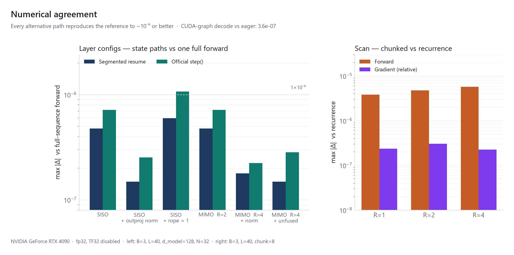
</p>

The error also does not accumulate. It is flat from `L=32` to `L=4096`, and a streaming state replayed a thousand steps in a row does not drift away from the batch forward.

<p align="center">
  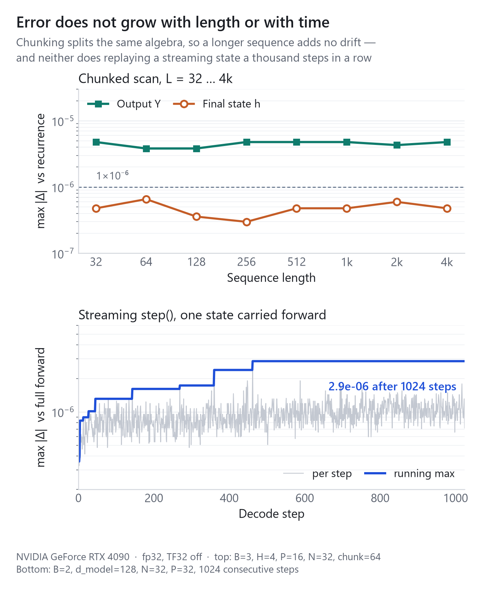
</p>

`chunk_size` is a tuning knob only: `Q` partitions the same algebra, so the result holds across `Q = 1 … 256` while the GEMM shape — and the speed — changes. The fastest `Q` sits at or just above the documented default of `64 / mimo_rank`.

<p align="center">
  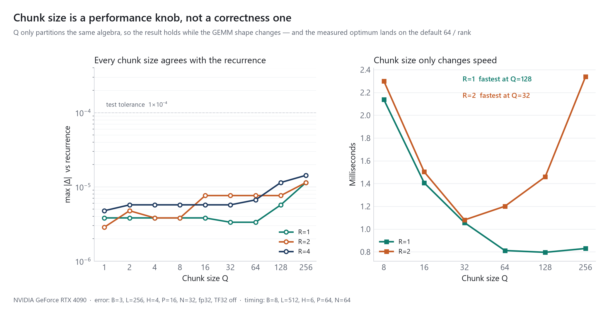
</p>

Two deviations are intentional — the official counterparts are language-model only:

- **`MixerModel` drops the embedding.** This stack takes `(batch, seqlen, d_model)` features directly.
- **`capture_graph` uses `hidden_states`.** Official static buffers are `input_ids` / `position_ids`.

Everything else follows the official code line by line. Not implemented: `cu_seqlens`, `seq_idx`, tensor parallelism, kernel-level fusion.

---

## Benchmarks

Same machine as above. Every number and figure comes from `python scripts/bench_figures.py`.

Each timing is the median of five timed blocks after warmup. Most calls here are launch bound and land near a millisecond, where a single block moves by more than 20% from GPU clock drift alone — enough to read as a regression that is not in the code. What survives the median is drift on a scale of tens of seconds, so treat the last digit of a ~1 ms reading as ±10% and compare orders of magnitude, not third digits.

### Chunked scan vs the recurrence

Recurrent time grows linearly with `L`; chunked time stays near 1 ms, because the inner work is cuBLAS GEMMs.

<p align="center">
  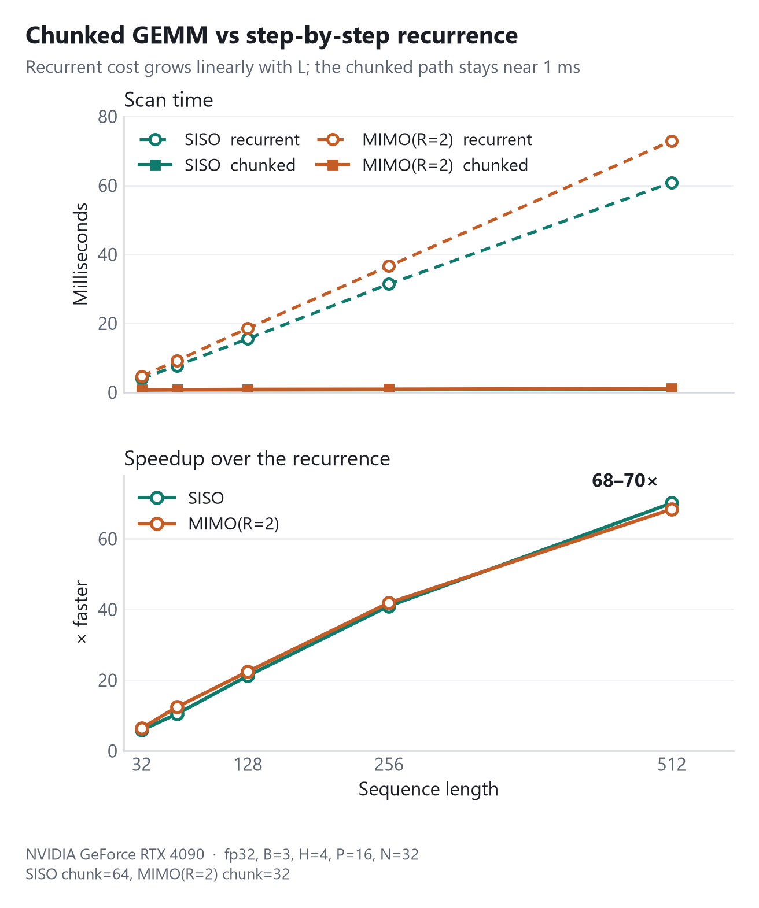
</p>

<div align="center">

| | L=32 | L=128 | L=512 |
|---|---:|---:|---:|
| SISO chunked | 0.67 ms | 0.73 ms | 0.87 ms |
| SISO vs recurrence | 5.9× | 21.2× | **70.1×** |
| MIMO(R=2) chunked | 0.73 ms | 0.83 ms | 1.07 ms |
| MIMO(R=2) vs recurrence | 6.4× | 22.4× | **68.3×** |

</div>

### Why long sequences are trainable at all

Backprop through `L` Python steps is the wall a readable reference implementation hits — in wall-clock time and in the size of the autograd graph.

<p align="center">
  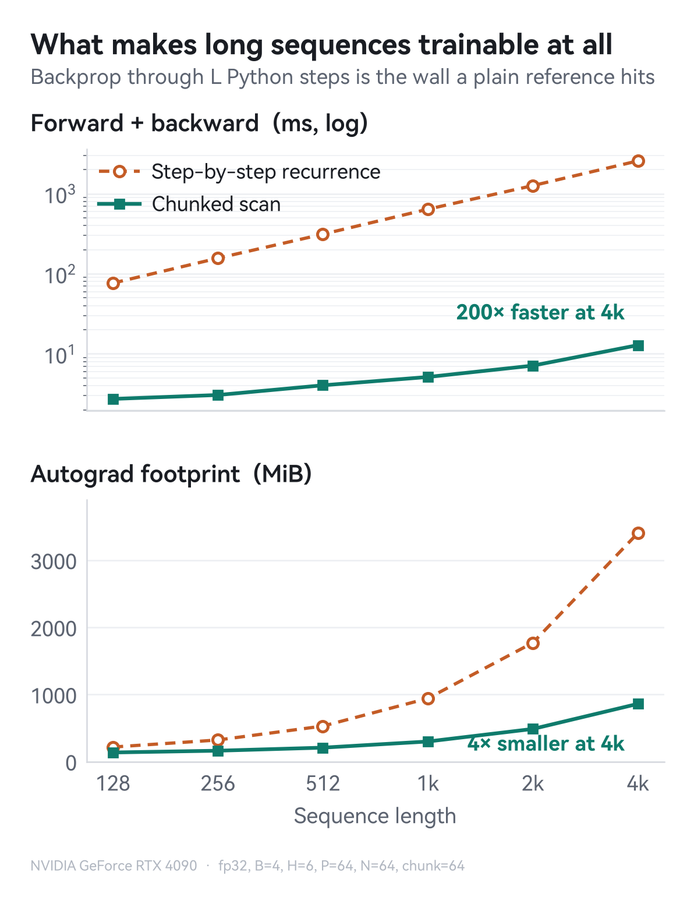
</p>

<div align="center">

| Sequence length | 128 | 1k | 4k |
|---|---:|---:|---:|
| Recurrence, fwd + bwd | 76 ms | 640 ms | 2568 ms |
| Chunked scan, fwd + bwd | 2.7 ms | 5.1 ms | **12.8 ms** |
| Recurrence, peak allocated | 218 MiB | 942 MiB | 3404 MiB |
| Chunked scan, peak allocated | 137 MiB | 300 MiB | **861 MiB** |

</div>

### Constant state vs a growing KV cache

The reason to reach for an SSM. Decoding one token costs the same whether 256 or 16384 tokens came before, and one fixed-size state replaces a cache that grows with context. The baseline is a causal-attention layer of the same width decoding against a preallocated KV cache through PyTorch SDPA.

<p align="center">
  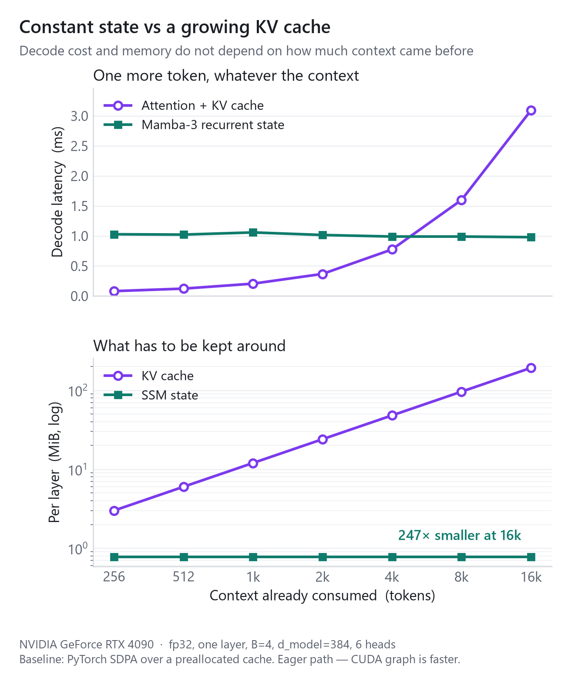
</p>

<div align="center">

| Context | 256 | 1k | 4k | 16k |
|---|---:|---:|---:|---:|
| Attention + KV cache | 0.07 ms | 0.20 ms | 0.76 ms | 3.07 ms |
| Mamba-3 recurrent state | 0.96 ms | 0.85 ms | 0.95 ms | **0.92 ms** |
| KV cache, per layer | 3.0 MiB | 12.0 MiB | 48.0 MiB | 192.0 MiB |
| SSM state, per layer | 0.78 MiB | 0.78 MiB | 0.78 MiB | **0.78 MiB** |

</div>

Latency crosses over between 4k and 8k tokens; memory is flat throughout, 247× smaller at 16k. Two caveats worth stating plainly: that flat line is the *eager* path, so a captured graph moves it further down, and for batched **prefill** the fused attention kernels stay ahead of a pure-PyTorch scan. The structural win is in streaming decode.

### Eager vs graph decode

Decoding one token at a time, 3 layers, batch 64, `d_model=320`. After the dedicated single-step path, a step is still mostly kernel-launch overhead, which a graph replay removes.

<p align="center">
  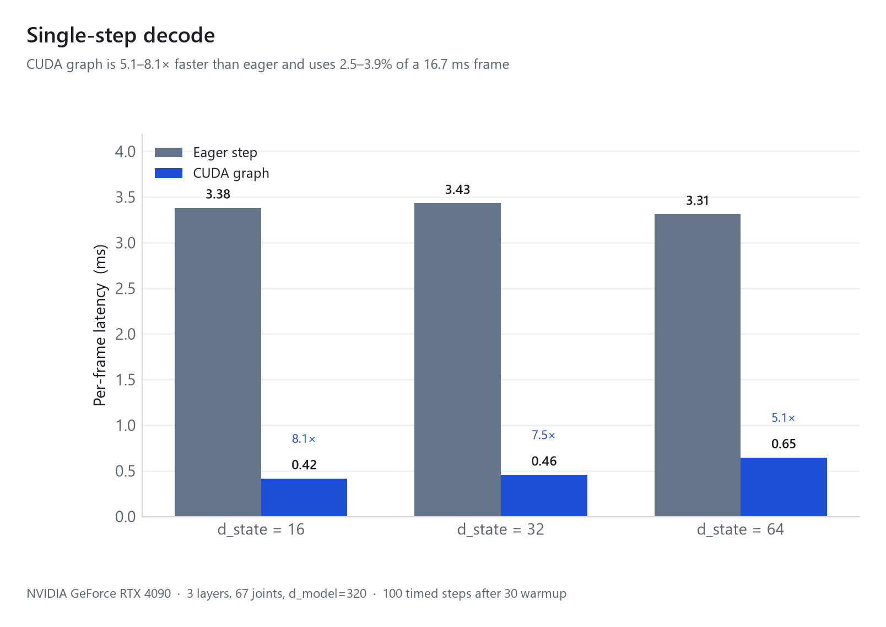
</p>

<div align="center">

| `d_state` | Eager | Graph replay | Speedup | of 60 FPS |
|---:|---:|---:|---:|---:|
| 16 | 3.13 ms | **0.47 ms** | 6.6× | 2.8% |
| 32 | 3.22 ms | **0.52 ms** | 6.2× | 3.1% |
| 64 | 3.21 ms | **0.74 ms** | 4.3× | 4.4% |

</div>

### Adding `torch.compile`

Replay and compilation remove different costs, so the two stack: replay removes the launch overhead, compilation removes the launches. Same stack as above at `d_state=32`, decoding one token.

<p align="center">
  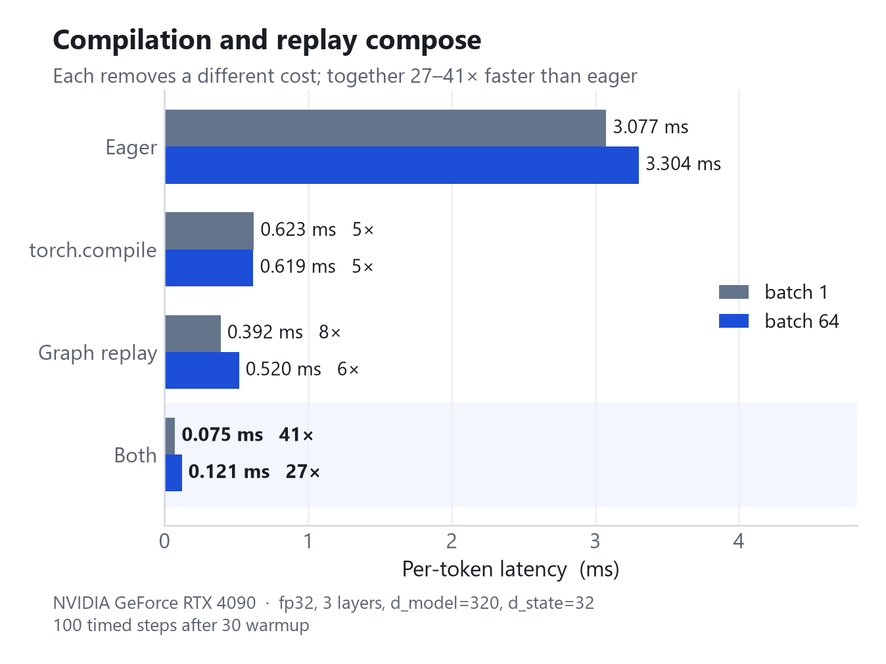
</p>

Either one alone lands near 0.5 ms — compilation wins at batch 64, replay wins at batch 1 — and together they are another 4–5× below that. `mode="reduce-overhead"` measures the same as the default within noise, for the reason in [Implementation notes](#implementation-notes).

### Training throughput

Autograd runs straight through the chunked scan — no custom backward, no recompute hooks. Per-token cost bottoms out near `L ≈ 512–1024`, where launch overhead is amortized but chunk intermediates still fit comfortably.

<p align="center">
  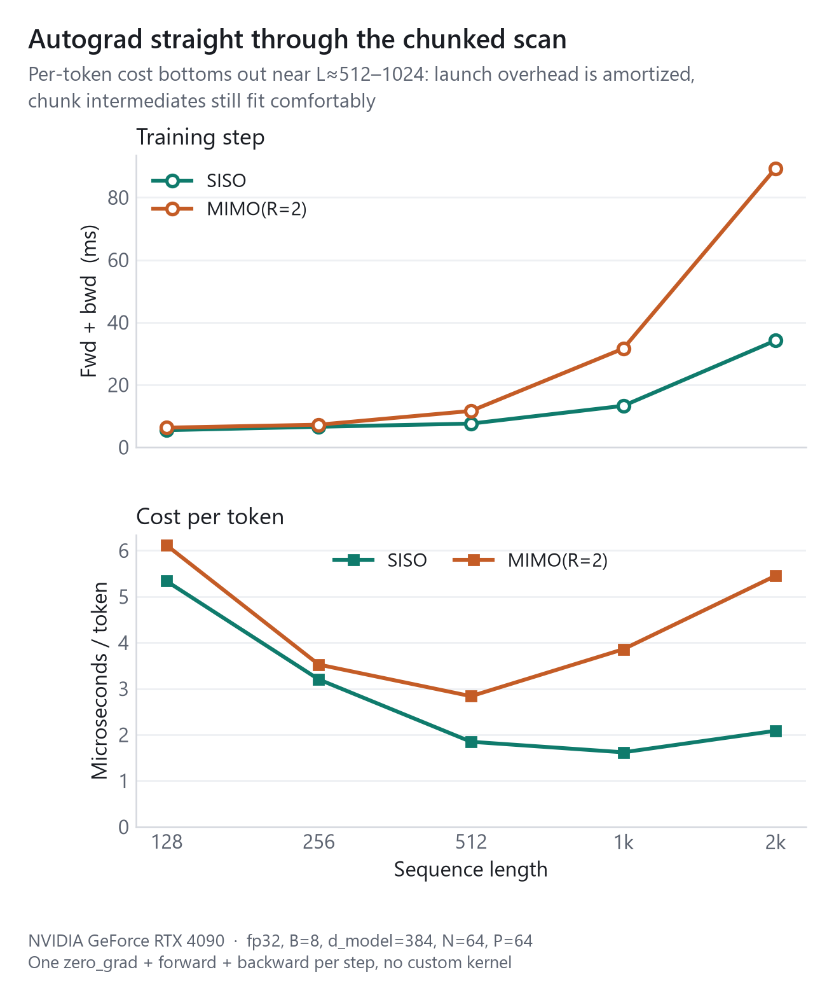
</p>

### Reproducing

```bash
python scripts/test_mamba3.py      # numerical self-checks + benchmarks
python scripts/bench_figures.py    # re-measure and redraw every figure above
python scripts/arch_figure.py      # redraw the diagram at the top
python scripts/stats_figure.py     # redraw the headline numbers
```

`scripts/bench_figures.py --replot` redraws from `assets/results.json` without touching the GPU. Nothing under `scripts/` is needed to use the library — it is there to check the numbers and draw the figures. The root holds one file, and that file is the whole thing.

---

## API map

<div align="center">

| Official `mamba_ssm` | This file |
|---|---|
| `modules.mamba3.Mamba3` | `Mamba3` |
| `modules.mamba3.heavy_tail_activation` | `heavy_tail_activation` |
| `modules.block.Block` | `Block` |
| `models.mixer_seq_simple.create_block` | `create_block` |
| `models.mixer_seq_simple.MixerModel` | `MixerModel` |
| `modules.mlp.GatedMLP` | `GatedMLP` |
| `ops.triton.layernorm_gated.RMSNorm` | `RMSNorm` (`RMSNormGated`) |
| `ops.triton.layernorm_gated.rms_norm_ref` | `rms_norm_ref` |
| `ops.triton.mamba3.mamba3_siso_combined` | `mamba3_siso_combined` |
| `ops.tilelang.mamba3.mamba3_mimo` | `mamba3_mimo_combined` |
| `utils.generation.InferenceParams` | `InferenceParams` |
| `utils.generation.DecodingCGCache` | `DecodingCGCache` |
| `utils.generation.capture_graph` | `capture_graph` |
| `utils.generation.update_graph_cache` | `update_graph_cache` |

</div>

## Implementation notes

**Chunked parallel scan.** Unrolling the linear recurrence gives

```math
h_t = e^{\mathrm{cs}_t}\, h_{-1} + \sum_{s \le t} e^{\mathrm{cs}_t - \mathrm{cs}_s}\, u_s,
\qquad
\mathrm{cs}_t = \sum_{k \le t} A_k\, \mathrm{dt}_k
```

Split into chunks of length `Q`: every `(i, j)` pair inside a chunk is one matmul, and only `L/Q` states move serially. Training uses this path; decoding uses the step-by-step recurrence.

**Dedicated single-step path.** `step()` does not route through the general length-axis scan. `_mamba3_step` drops the axis rather than degenerating it to one — no single-element `cumsum`, no stack of a singleton, no packing/unpacking through `unsqueeze(1)`. The arithmetic order stays the same, so results are bit-identical to `_mamba3_combined` at `L = 1` (asserted with `torch.equal` in `test_mamba3.py`). On the eager path this cuts ~100 aten calls per token; graph replay still removes the remaining launch overhead.

**Graph decoding.** Single-step decode remains largely kernel-launch overhead. `capture_graph` records the whole call chain into one graph. States update in place with `copy_`, so a replay reads and writes the addresses fixed at capture time.

Everything around the capture — streams, synchronization, cache trimming, memory pools — goes through the device-agnostic `torch.accelerator` API, so nothing here is CUDA-only by construction. The one exception is the graph object itself: `torch.accelerator.Graph` is the neutral interface, but as of PyTorch 2.13 only XPU registers an implementation and constructing one on CUDA raises, so `_new_graph` falls back to `torch.cuda.CUDAGraph`. That fallback is the single named backend in the file; when CUDA registers its implementation ([pytorch#171313](https://github.com/pytorch/pytorch/pull/171313)) the neutral path is taken with no other change.

One consequence of dropping `torch.cuda.graph` is worth naming: it captured on a class-level stream shared by every graph, which is what let graphs sharing a mempool actually reuse memory. Capturing each on its own stream doubles reserved memory across a multi-graph cache. `DecodingCGCache` therefore holds the capture stream next to the pool and passes both to every capture.

**Composing with `torch.compile`.** Compilation and replay remove different costs, so they stack, and the file needs no code for either. One subtlety is worth recording because the usual advice points the other way: `mode="reduce-overhead"` is normally the decode mode, since it adds CUDA graphs of its own — which under an explicit capture would be the classic double-graphing. That cannot happen here. The in-place `copy_` state updates count as mutated inputs, so inductor logs `skipping cudagraphs due to mutated inputs` and turns them off by itself. With its one distinguishing feature disabled, `reduce-overhead` measures the same as `default` either way, so plain `torch.compile(model)` is what belongs under a capture.

**No einops.** On this path Python itself is hot; `rearrange` pattern parsing measured +10.8% on eager single-step. The file uses `reshape` / `permute` / `einsum`.

### Mamba-3 vs Mamba-2

1. **Exponential-trapezoidal discretization**

   ```math
   h_t = e^{A\, \mathrm{dt}_t}\, h_{t-1}
       + \mathrm{dt}_t \Big[ (1 - \mathrm{tr}_t)\, Bx_t
       + \mathrm{tr}_t\, \frac{Bx_t + Bx_{t-1}}{2} \Big]
   ```

   `tr_t` is a learnable sigmoid gate: `tr=0` is Euler/ZOH, `tr=1` is full trapezoidal integration. Equivalent to $u_t = \alpha_t Bx_t + \beta_t Bx_{t-1}$ with $\alpha_t = \mathrm{dt}_t (1 - \mathrm{tr}_t / 2)$ and $\beta_t = \mathrm{dt}_t\, \mathrm{tr}_t / 2$, which keeps the recurrence linear in `(X, B)`.

2. **Complex (rotary) state space.** RoPE on `B` / `C`, angles scaled by `dt` and accumulated over time, so a real-valued state can express periodic dependencies.

3. **MIMO.** A rank-`R` projection turns the state write into a matmul. Persistent state stays `(B, H, P, N)`; `R` appears only on the read/write paths.

```
B batch | L seqlen | H nheads | P headdim | N d_state
G num_bc_heads | R mimo_rank | S num_rope_angles
Q = C readout | K = B write | V = x values
```

## Citation

```bibtex
@article{lahoti2026mamba3,
  title   = {Mamba-3: Improved Sequence Modeling using State Space Principles},
  author  = {Lahoti, Aakash and Li, Kevin Y. and Chen, Berlin and Wang, Caitlin
             and Bick, Aviv and Kolter, J. Zico and Dao, Tri and Gu, Albert},
  journal = {arXiv preprint arXiv:2603.15569},
  year    = {2026}
}
```
